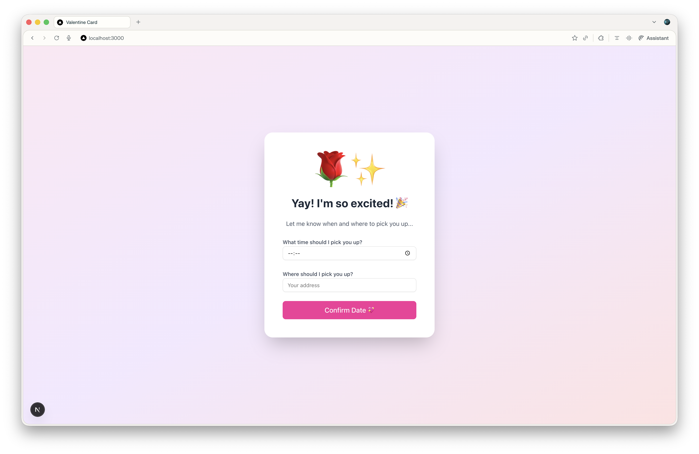
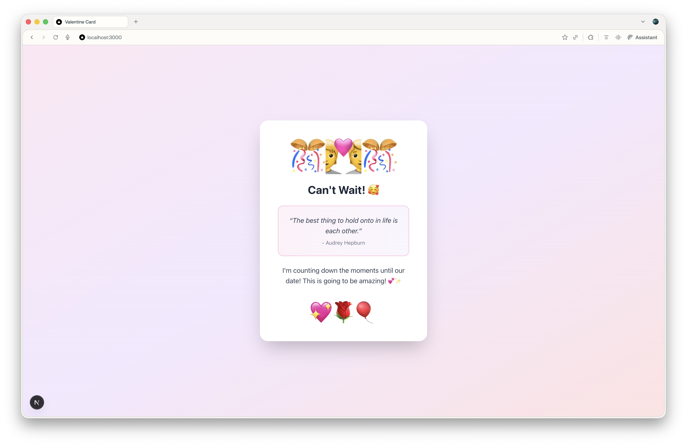

> **🌍 Языковые версии:** [English](https://github.com/v3sker/nextjs-valentine-card) | [Русский (Russian)](https://github.com/v3sker/nextjs-valentine-card/tree/russian-version)

# 💝 Интерактивная валентинка

Красивая интерактивная веб-валентинка, созданная с помощью Next.js. Это одностраничное приложение включает несколько этапов, которые создают уникальный и увлекательный опыт для вашего любимого человека!


## ✨ Возможности

- 🔒 **Секретный код** - Защитите ваше сообщение персонализированным секретным кодом
- 💖 **Интерактивный вопрос** - Задайте главный вопрос с игривой кнопкой "Нет", которая убегает от курсора
- 📅 **Форма деталей свидания** - Соберите время и адрес встречи через серверную форму
- 🎨 **Красивый интерфейс** - Создано с Tailwind CSS и компонентами shadcn/ui
- 📱 **Полная адаптивность** - Безупречно работает на мобильных устройствах и компьютерах
- ⚡ **Плавные анимации** - Восхитительные переходы между этапами

## 🚀 Быстрый старт

### Требования

- Node.js 16.8 или новее
- npm, yarn, pnpm или bun

### Установка

1. **Клонируйте или скачайте этот репозиторий**

2. **Установите зависимости**
   ```bash
   npm install
   ```

3. **Создайте файл окружения**
   
   Создайте файл `.env.local` в корневой директории:
   ```env
   SECRET_CODE=ВашСекретныйКод123
   PERSON_NAME=Имя любимого человека
   ```

4. **Запустите сервер разработки**
   ```bash
   npm run dev
   ```

5. **Откройте браузер**
   
   Перейдите по адресу [http://localhost:3000](http://localhost:3000)

## 🎯 Как это работает

Открытка проходит через 4 этапа:

### Этап 1: Ввод секретного кода 🔒


- Отображает иконку закрытого сердца
- Пользователь должен ввести правильный секретный код для продолжения
- Показывает сообщение об ошибке при неправильном коде

### Этап 2: Вопрос 💝


- Приветствует человека по имени (из переменной окружения)
- Отображает романтичную цитату
- Задаёт вопрос "Будешь моей валентинкой?"
- **Кнопка "Да"** - Переход к следующему этапу
- **Кнопка "Нет"** - Игриво убегает, когда вы наводите на неё курсор!

### Этап 3: Форма деталей свидания 🌹



- Собирает время встречи через выбор времени
- Собирает адрес встречи через текстовое поле
- Отправляет данные на сервер
- Сервер записывает детали в консоль

### Этап 4: Финальное сообщение 🎊



- Показывает праздничное сообщение
- Отображает ещё одну романтичную цитату
- Выражает восторг от предстоящего свидания

## 🛠️ Руководство по настройке

### Персонализация вашей открытки

#### 1. Переменные окружения (`.env.local`)

Отредактируйте эти значения для персонализации открытки:

```env
# Секретный код для разблокировки открытки
SECRET_CODE=ЛЮБОВЬ2026

# Имя вашего любимого человека
PERSON_NAME=Ваш особенный человек
```

#### 2. Цитаты о любви

Чтобы изменить цитаты, отредактируйте `src/components/ValentineCard.jsx`:

**Цитата этапа 2 (строки ~95-99):**
```jsx
<p className="text-lg italic text-gray-700">
  &ldquo;Ваша цитата здесь&rdquo;
</p>
<p className="text-sm text-gray-500 mt-2">- Имя автора</p>
```

**Цитата этапа 4 (строки ~183-187):**
```jsx
<p className="text-lg italic text-gray-700">
  &ldquo;Ваша цитата здесь&rdquo;
</p>
<p className="text-sm text-gray-500 mt-2">- Имя автора</p>
```

#### 3. Эмодзи и иконки

Измените эмодзи-иконки в `src/components/ValentineCard.jsx`:

- **Этап 1:** Строка ~56: `<div className="text-8xl">🔒❤️</div>`
- **Этап 2:** Строка ~90: `<div className="text-8xl">💝</div>`
- **Этап 3:** Строка ~128: `<div className="text-8xl">🌹✨</div>`
- **Этап 4:** Строка ~177: `<div className="text-8xl">🎊💑🎊</div>`

#### 4. Цвета

Открытка использует розово-фиолетово-красную цветовую схему. Чтобы изменить цвета, отредактируйте классы Tailwind в `src/components/ValentineCard.jsx`:

- **Градиент фона:** Строка ~51: `bg-linear-to-br from-pink-100 via-purple-100 to-red-100`
- **Кнопка "Да":** `bg-green-500 hover:bg-green-600`
- **Кнопка "Нет":** `bg-red-500 hover:bg-red-600`
- **Кнопки отправки:** `bg-pink-500 hover:bg-pink-600`

#### 5. Сообщения и текст

Редактируйте любой текст непосредственно в компоненте:
- Сообщение разблокировки (Этап 1)
- Текст вопроса (Этап 2)
- Метки формы (Этап 3)
- Финальное сообщение (Этап 4)

## 📁 Структура проекта

```
nextjs-valentine-card/
├── src/
│   ├── app/
│   │   ├── actions.js           # Серверное действие для отправки формы
│   │   ├── globals.css          # Глобальные стили
│   │   ├── layout.js            # Корневой макет
│   │   └── page.js              # Главная страница (передаёт переменные окружения)
│   ├── components/
│   │   ├── ui/
│   │   │   ├── button.jsx       # Компонент кнопки shadcn
│   │   │   └── input.jsx        # Компонент ввода shadcn
│   │   └── ValentineCard.jsx    # Главный компонент валентинки
│   └── lib/
│       └── utils.js             # Вспомогательные функции
├── .env.local                   # Переменные окружения (создайте этот файл!)
├── package.json
└── README.md
```

## 🔧 Технические детали

### Создано с помощью

- **[Next.js 16](https://nextjs.org/)** - React фреймворк с App Router
- **[React 19](https://react.dev/)** - Библиотека UI
- **[Tailwind CSS v4](https://tailwindcss.com/)** - CSS-фреймворк на основе утилит
- **[shadcn/ui](https://ui.shadcn.com/)** - Библиотека переиспользуемых компонентов
- **[Lucide React](https://lucide.dev/)** - Библиотека иконок

### Ключевые возможности

- **Server Actions** - Отправка формы обрабатывается безопасно на сервере
- **Client Components** - Интерактивный UI с React хуками
- **Environment Variables** - Безопасное управление конфигурацией
- **Responsive Design** - Подход mobile-first с Tailwind

### Серверное действие

Отправка формы на этапе 3 использует Next.js Server Actions (`src/app/actions.js`):

```javascript
export async function submitDateDetails(formData) {
  const hour = formData.get('hour');
  const address = formData.get('address');

  console.log('=== Детали свидания на День Валентина ===');
  console.log('Время:', hour);
  console.log('Адрес:', address);
  console.log('=============================');

  return { success: true };
}
```

Проверьте консоль сервера (терминал, где запущен `npm run dev`), чтобы увидеть отправленные данные.

## 🚢 Развёртывание

### Развёртывание на Vercel (Рекомендуется)

1. Загрузите код на GitHub
2. Импортируйте репозиторий на [Vercel](https://vercel.com)
3. Добавьте переменные окружения в панели Vercel:
   - `SECRET_CODE`
   - `PERSON_NAME`
4. Разверните!

### Другие платформы

Это приложение Next.js может быть развёрнуто на любой платформе, поддерживающей Node.js:
- Netlify
- AWS Amplify
- Railway
- Render
- Ваш собственный сервер с Docker

Не забудьте установить переменные окружения на вашей платформе развёртывания!

## 💡 Советы и идеи

- **Поделитесь секретным кодом** отдельно от URL (текстовое сообщение, записка и т.д.)
- **Разверните до Дня Валентина** и отправьте ссылку + код в качестве сюрприза
- **Настройте цвета**, чтобы они соответствовали любимым цветам вашего партнёра
- **Добавьте свои фотографии** вместо эмодзи (требуется загрузка изображений)
- **Расширьте функциональность** - Добавьте больше этапов, звуков или анимаций!

## 🐛 Устранение неполадок

**Проблема:** Секретный код не работает
- **Решение:** Убедитесь, что файл `.env.local` существует и `SECRET_CODE` совпадает точно (учитывается регистр)

**Проблема:** Имя не отображается
- **Решение:** Проверьте `PERSON_NAME` в `.env.local` и перезапустите сервер разработки

**Проблема:** Стили выглядят сломанными
- **Решение:** Убедитесь, что все зависимости установлены (`npm install`)

**Проблема:** Отправка формы не записывается
- **Решение:** Проверьте терминал, где запущен `npm run dev`, а не консоль браузера

## 📝 Лицензия

Этот проект имеет открытый исходный код и доступен для личного использования. Настройте его для вашего особенного человека!

## ❤️ Сделано с любовью

Создано как особый способ задать тот важный вопрос на День Валентина. Удачи! 🍀💕

---

**С Днём Валентина! 💝**
