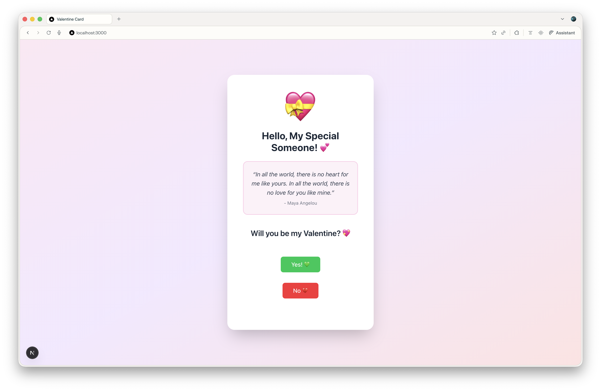

# 💝 Interactive Valentine's Day Card

A beautiful, interactive web-based Valentine's Day card built with Next.js. This single-page application features multiple stages that create a unique and engaging experience for your special someone!



## ✨ Features

- 🔒 **Secret Code Lock** - Protect your message with a personalized secret code
- 💖 **Interactive Question** - Ask the big question with a playful "No" button that runs away from the cursor
- 📅 **Date Details Form** - Collect pickup time and address through a server-side form
- 🎨 **Beautiful UI** - Built with Tailwind CSS and shadcn/ui components
- 📱 **Fully Responsive** - Works seamlessly on mobile and desktop devices
- ⚡ **Smooth Animations** - Delightful transitions between each stage

## 🚀 Quick Start

### Prerequisites

- Node.js 16.8 or later
- npm, yarn, pnpm, or bun

### Installation

1. **Clone or download this repository**

2. **Install dependencies**
   ```bash
   npm install
   ```

3. **Create your environment file**
   
   Create a `.env.local` file in the root directory:
   ```env
   SECRET_CODE=YourSecretCode123
   PERSON_NAME=Their Name
   ```

4. **Run the development server**
   ```bash
   npm run dev
   ```

5. **Open your browser**
   
   Navigate to [http://localhost:3000](http://localhost:3000)

## 🎯 How It Works

The card progresses through 4 stages:

### Stage 1: Secret Code Entry 🔒


- Displays a locked heart icon
- User must enter the correct secret code to proceed
- Shows error message for incorrect codes

### Stage 2: The Question 💝


- Greets the person by name (from environment variable)
- Displays a romantic quote
- Asks "Will you be my Valentine?"
- **Yes button** - Proceeds to next stage
- **No button** - Playfully moves away when you hover over it!

### Stage 3: Date Details Form 🌹


- Collects pickup time using a time picker
- Collects pickup address through text input
- Submits data to server action
- Server logs the details to console

### Stage 4: Final Message 🎊


- Shows celebratory message
- Displays another romantic quote
- Expresses excitement for the upcoming date

## 🛠️ Customization Guide

### Personalizing Your Card

#### 1. Environment Variables (`.env.local`)

Edit these values to personalize your card:

```env
# The secret code to unlock the card
SECRET_CODE=LOVEYOU2026

# The name of your special someone
PERSON_NAME=Your Special Someone
```

#### 2. Love Quotes

To change the quotes, edit `src/components/ValentineCard.jsx`:

**Stage 2 Quote (lines ~95-99):**
```jsx
<p className="text-lg italic text-gray-700">
  &ldquo;Your custom quote here&rdquo;
</p>
<p className="text-sm text-gray-500 mt-2">- Author Name</p>
```

**Stage 4 Quote (lines ~183-187):**
```jsx
<p className="text-lg italic text-gray-700">
  &ldquo;Your custom quote here&rdquo;
</p>
<p className="text-sm text-gray-500 mt-2">- Author Name</p>
```

#### 3. Emojis and Icons

Change the emoji icons in `src/components/ValentineCard.jsx`:

- **Stage 1:** Line ~56: `<div className="text-8xl">🔒❤️</div>`
- **Stage 2:** Line ~90: `<div className="text-8xl">💝</div>`
- **Stage 3:** Line ~128: `<div className="text-8xl">🌹✨</div>`
- **Stage 4:** Line ~177: `<div className="text-8xl">🎊💑🎊</div>`

#### 4. Colors

The card uses a pink/purple/red color scheme. To change colors, edit the Tailwind classes in `src/components/ValentineCard.jsx`:

- **Background gradient:** Line ~51: `bg-linear-to-br from-pink-100 via-purple-100 to-red-100`
- **Yes button:** `bg-green-500 hover:bg-green-600`
- **No button:** `bg-red-500 hover:bg-red-600`
- **Submit buttons:** `bg-pink-500 hover:bg-pink-600`

#### 5. Messages and Text

Edit any text directly in the component:
- Unlock message (Stage 1)
- Question text (Stage 2)
- Form labels (Stage 3)
- Final message (Stage 4)

## 📁 Project Structure

```
nextjs-valentine-card/
├── src/
│   ├── app/
│   │   ├── actions.js           # Server action for form submission
│   │   ├── globals.css          # Global styles
│   │   ├── layout.js            # Root layout
│   │   └── page.js              # Main page (passes env vars)
│   ├── components/
│   │   ├── ui/
│   │   │   ├── button.jsx       # shadcn Button component
│   │   │   └── input.jsx        # shadcn Input component
│   │   └── ValentineCard.jsx    # Main Valentine card component
│   └── lib/
│       └── utils.js             # Utility functions
├── .env.local                   # Environment variables (create this!)
├── package.json
└── README.md
```

## 🔧 Technical Details

### Built With

- **[Next.js 16](https://nextjs.org/)** - React framework with App Router
- **[React 19](https://react.dev/)** - UI library
- **[Tailwind CSS v4](https://tailwindcss.com/)** - Utility-first CSS framework
- **[shadcn/ui](https://ui.shadcn.com/)** - Re-usable component library
- **[Lucide React](https://lucide.dev/)** - Icon library

### Key Features

- **Server Actions** - Form submission handled securely on the server
- **Client Components** - Interactive UI with React hooks
- **Environment Variables** - Secure configuration management
- **Responsive Design** - Mobile-first approach with Tailwind

### Server Action

The form submission in Stage 3 uses Next.js Server Actions (`src/app/actions.js`):

```javascript
export async function submitDateDetails(formData) {
  const hour = formData.get('hour');
  const address = formData.get('address');

  console.log('=== Valentine Date Details ===');
  console.log('Hour:', hour);
  console.log('Address:', address);
  console.log('=============================');

  return { success: true };
}
```

Check your server console (terminal where `npm run dev` is running) to see the submitted details.

## 🚢 Deployment

### Deploy to Vercel (Recommended)

1. Push your code to GitHub
2. Import your repository on [Vercel](https://vercel.com)
3. Add environment variables in Vercel dashboard:
   - `SECRET_CODE`
   - `PERSON_NAME`
4. Deploy!

### Other Platforms

This Next.js app can be deployed to any platform that supports Node.js:
- Netlify
- AWS Amplify
- Railway
- Render
- Your own server with Docker

Remember to set your environment variables in your deployment platform!

## 💡 Tips & Ideas

- **Share the secret code** separately from the URL (text message, note, etc.)
- **Deploy before Valentine's Day** and send the link + code as a surprise
- **Customize the colors** to match your partner's favorite colors
- **Add your own photos** instead of emojis (requires image uploads)
- **Extend functionality** - Add more stages, sounds, or animations!

## 🐛 Troubleshooting

**Issue:** Secret code doesn't work
- **Solution:** Make sure `.env.local` file exists and `SECRET_CODE` matches exactly (case-sensitive)

**Issue:** Name not showing up
- **Solution:** Check `PERSON_NAME` in `.env.local` and restart the dev server

**Issue:** Styles look broken
- **Solution:** Ensure all dependencies are installed (`npm install`)

**Issue:** Form submission not logging
- **Solution:** Check your terminal where `npm run dev` is running, not browser console

## 📝 License

This project is open source and available for personal use. Feel free to customize it for your special someone!

## ❤️ Made with Love

Created as a special way to ask that important Valentine's Day question. Good luck! 🍀💕

---

**Happy Valentine's Day! 💝**
